# Function Call Diagram

This diagram shows how functions call each other starting from `generateColorCss` in `generator.ts`.

## Mermaid Diagram

```mermaid
flowchart TD
    subgraph generator.ts
        generateColorCss["generateColorCss()"]
        validateLabel["validateLabel()"]
        validateUniqueLabels["validateUniqueLabels()"]
        generateBaseColorCss["generateBaseColorCss()"]
        generateContrastColorCss["generateContrastColorCss()"]
        generateHeuristicCss["generateHeuristicCss()"]
        generateNormalPolarityCss["generateNormalPolarityCss()"]
        generateReversePolarityCss["generateReversePolarityCss()"]
        generateTargetYCss["generateTargetYCss()"]
        formatNumber["formatNumber()"]
        cssVar["cssVar()"]
        cssTentFunction["cssTentFunction()"]
        cssIsInGamut["cssIsInGamut()"]
        cssBooleanFlag["cssBooleanFlag()"]
        cssGreaterThan["cssGreaterThan()"]
        cssHermiteInterpolation["cssHermiteInterpolation()"]
        cssApcaNormalContrast["cssApcaNormalContrast()"]
        cssApcaReverseContrast["cssApcaReverseContrast()"]
        cssBestContrastFallback["cssBestContrastFallback()"]
    end

    subgraph color.ts
        findGamutSlice["findGamutSlice()"]
        findMaxChromaAtLightness["findMaxChromaAtLightness()"]
        fitCurvature["fitCurvature()"]
        computeMaxChroma["computeMaxChroma()"]
        gamutMap["gamutMap()"]
        getLuminance["getLuminance()"]
        createColor["createColor()"]
    end

    subgraph heuristic.ts
        fitHeuristicCoefficients["fitHeuristicCoefficients()"]
        sampleErrors["sampleErrors()"]
        computeSamplePoint["computeSamplePoint()"]
        coarseGridSearch["coarseGridSearch()"]
        fineGridSearch["fineGridSearch()"]
        evaluateCoefficients["evaluateCoefficients()"]
        computeBoost["computeBoost()"]
        scoreCoefficients["scoreCoefficients()"]
    end

    subgraph contrast.ts
        applyContrast["applyContrast()"]
    end

    subgraph measure.ts
        measureContrast["measureContrast()"]
        calculateAPCAcontrast["calculateAPCAcontrast()"]
    end

    subgraph apca.ts
        solveTargetY["solveTargetY()"]
        solveApcaNormal["solveApcaNormal()"]
        solveApcaReverse["solveApcaReverse()"]
        estimateContrast["estimateContrast()"]
        signedPow["signedPow()"]
    end

    %% Main entry point
    generateColorCss --> validateLabel
    generateColorCss --> validateUniqueLabels
    generateColorCss --> findGamutSlice
    generateColorCss --> generateBaseColorCss
    generateColorCss --> generateContrastColorCss

    %% generateBaseColorCss dependencies
    generateBaseColorCss --> formatNumber
    generateBaseColorCss --> cssTentFunction

    %% generateContrastColorCss dependencies
    generateContrastColorCss --> fitHeuristicCoefficients
    generateContrastColorCss --> generateHeuristicCss
    generateContrastColorCss --> generateNormalPolarityCss
    generateContrastColorCss --> generateReversePolarityCss
    generateContrastColorCss --> generateTargetYCss
    generateContrastColorCss --> formatNumber
    generateContrastColorCss --> cssVar
    generateContrastColorCss --> cssTentFunction

    %% generateHeuristicCss dependencies
    generateHeuristicCss --> formatNumber

    %% generateNormalPolarityCss dependencies
    generateNormalPolarityCss --> cssVar
    generateNormalPolarityCss --> cssIsInGamut
    generateNormalPolarityCss --> cssBooleanFlag
    generateNormalPolarityCss --> cssHermiteInterpolation

    %% generateReversePolarityCss dependencies
    generateReversePolarityCss --> cssVar
    generateReversePolarityCss --> cssIsInGamut
    generateReversePolarityCss --> cssBooleanFlag
    generateReversePolarityCss --> cssHermiteInterpolation

    %% generateTargetYCss dependencies
    generateTargetYCss --> cssVar
    generateTargetYCss --> cssBooleanFlag
    generateTargetYCss --> cssApcaNormalContrast
    generateTargetYCss --> cssApcaReverseContrast
    generateTargetYCss --> cssBestContrastFallback

    %% cssBestContrastFallback dependencies
    cssBestContrastFallback --> cssGreaterThan

    %% fitHeuristicCoefficients dependencies
    fitHeuristicCoefficients --> sampleErrors
    fitHeuristicCoefficients --> coarseGridSearch
    fitHeuristicCoefficients --> fineGridSearch
    fitHeuristicCoefficients --> evaluateCoefficients

    %% sampleErrors dependencies
    sampleErrors --> computeSamplePoint

    %% computeSamplePoint dependencies
    computeSamplePoint --> gamutMap
    computeSamplePoint --> applyContrast
    computeSamplePoint --> measureContrast

    %% coarseGridSearch & fineGridSearch dependencies
    coarseGridSearch --> evaluateCoefficients
    coarseGridSearch --> scoreCoefficients
    fineGridSearch --> evaluateCoefficients
    fineGridSearch --> scoreCoefficients

    %% evaluateCoefficients dependencies
    evaluateCoefficients --> computeBoost

    %% applyContrast dependencies
    applyContrast --> gamutMap
    applyContrast --> solveTargetY
    applyContrast --> findGamutSlice
    applyContrast --> createColor

    %% measureContrast dependencies
    measureContrast --> getLuminance
    measureContrast --> calculateAPCAcontrast

    %% solveTargetY dependencies
    solveTargetY --> solveApcaNormal
    solveTargetY --> solveApcaReverse
    solveTargetY --> estimateContrast

    %% solveApcaNormal & solveApcaReverse dependencies
    solveApcaNormal --> signedPow
    solveApcaReverse --> signedPow

    %% findGamutSlice dependencies
    findGamutSlice --> findMaxChromaAtLightness
    findGamutSlice --> fitCurvature
    fitCurvature --> findMaxChromaAtLightness

    %% gamutMap dependencies
    gamutMap --> findGamutSlice
    gamutMap --> computeMaxChroma
```



## ASCII Diagram

```
generateColorCss (generator.ts)
│
├── validateLabel
├── validateUniqueLabels
├── findGamutSlice (color.ts)
│   ├── findMaxChromaAtLightness
│   └── fitCurvature
│       └── findMaxChromaAtLightness
│
├── generateBaseColorCss
│   ├── formatNumber
│   └── cssMaxChroma
│
└── generateContrastColorCss (for each contrast color)
    │
    ├── fitHeuristicCoefficients (heuristic.ts)
    │   ├── sampleErrors
    │   │   └── computeSamplePoint
    │   │       ├── gamutMap (color.ts)
    │   │       │   ├── findGamutSlice
    │   │       │   └── computeMaxChroma
    │   │       ├── applyContrast (contrast.ts)
    │   │       │   ├── gamutMap
    │   │       │   ├── solveTargetY (apca.ts)
    │   │       │   │   ├── solveApcaNormal
    │   │       │   │   │   └── signedPow
    │   │       │   │   ├── solveApcaReverse
    │   │       │   │   │   └── signedPow
    │   │       │   │   └── estimateContrast
    │   │       │   ├── findGamutSlice
    │   │       │   ├── computeMaxChroma
    │   │       │   └── createColor
    │   │       └── measureContrast (measure.ts)
    │   │           ├── getLuminance (color.ts)
    │   │           └── calculateAPCAcontrast
    │   ├── coarseGridSearch
    │   │   ├── evaluateCoefficients
    │   │   │   └── computeBoost
    │   │   └── scoreCoefficients
    │   ├── fineGridSearch
    │   │   ├── evaluateCoefficients
    │   │   └── scoreCoefficients
    │   └── evaluateCoefficients
    │
    ├── generateHeuristicCss
    │   └── formatNumber
    │
    ├── generateNormalPolarityCss
    │   ├── cssVar
    │   ├── cssIsInGamut
    │   ├── cssBooleanFlag
    │   └── cssHermiteInterpolation
    │
    ├── generateReversePolarityCss
    │   ├── cssVar
    │   ├── cssIsInGamut
    │   ├── cssBooleanFlag
    │   └── cssHermiteInterpolation
    │
    ├── generateTargetYCss
    │   ├── cssVar
    │   ├── cssBooleanFlag
    │   ├── cssApcaNormalContrast
    │   ├── cssApcaReverseContrast
    │   └── cssBestContrastFallback
    │       └── cssGreaterThan
    │
    ├── formatNumber
    ├── cssVar
    └── cssMaxChroma
```

## File Overview

| File | Purpose |
|------|---------|
| `generator.ts` | CSS generation - builds CSS custom properties for colors and contrast |
| `color.ts` | OKLCH color operations and Display P3 gamut mapping |
| `heuristic.ts` | Fits correction coefficients to compensate for Y ≈ L³ approximation |
| `contrast.ts` | Computes contrast colors using APCA |
| `measure.ts` | Measures APCA contrast between two colors |
| `apca.ts` | Solves APCA equations to find target luminance values |
